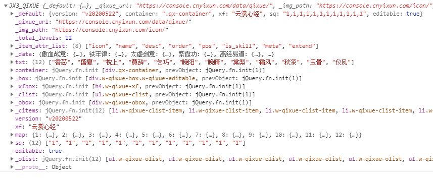

# 奇穴模拟器

> 讲个笑话，之前写的时候，只有上帝和我知道我写了些什么  
> 现在，只有上帝知道了……  
> 先酱，给一个无限期的承诺，或许有一天我会重构。  


## 使用空白配置
```javascript
let talent = new JX3_QIXUE()
```

## 使用指定配置
返回一个promise,参数为该talent实例
```javascript
let talent = new JX3_QIXUE({
    "xf":"冰心诀",
    "sq":"1,2,4,1,2,3,1,2,3,4,4,4",
    "editable":true
});
```

## 重载配置/方案
返回一个promise,参数为该talent实例
```javascript
talent.load({
    "xf":"冰心诀",
    "sq":"1,2,4,1,2,3,1,2,3,4,4,4",
    "editable":true
})
```

## 全局事件
任何修改，会触发`JX3_QIXUE_Change`全局事件，传递talent实例作为参数
```javascript
$(document).on("JX3_QIXUE_Change", function(e, ins) {
    let __data = {};
    __data.version = ins.version;
    __data.xf = ins.xf;
    __data.sq = ins.sq.join(",");
    let str = JSON.stringify(__data);
});
```

## 其它属性
